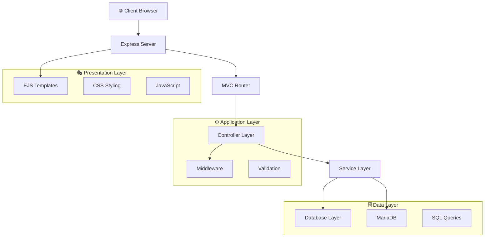
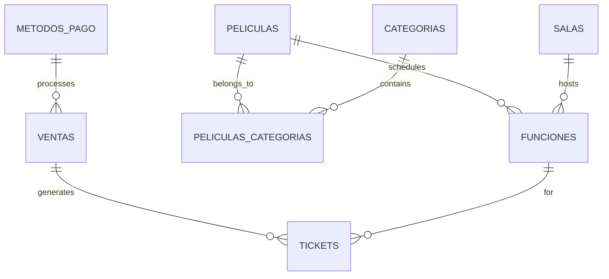

# 🎬 Cine Glorimar - Cinema Management System

[](https://nodejs.org/)
[](https://expressjs.com/)
[](https://mariadb.org/)
[](LICENSE)
[](CONTRIBUTING.md)

> A comprehensive cinema management system built with Node.js, Express, and MariaDB, featuring modern web interfaces and RESTful APIs for complete cinema operations management.

## 📋 Table of Contents

- [🎬 Cine Glorimar - Cinema Management System](#-cine-glorimar---cinema-management-system)
  - [📋 Table of Contents](#-table-of-contents)
  - [✨ Features](#-features)
  - [🏗️ Architecture](#️-architecture)
  - [🛠️ Technology Stack](#️-technology-stack)
  - [📁 Project Structure](#-project-structure)
  - [🚀 Quick Start](#-quick-start)
  - [📖 API Documentation](#-api-documentation)
  - [🎨 User Interface](#-user-interface)
  - [🗄️ Database Schema](#️-database-schema)
  - [🔧 Development](#-development)
  - [🚀 Deployment](#-deployment)
  - [🧪 Testing](#-testing)
  - [🤝 Contributing](#-contributing)
  - [📝 Changelog](#-changelog)
  - [📄 License](#-license)
  - [🙏 Acknowledgments](#-acknowledgments)

## ✨ Features

### 🎯 Core Functionality
- **🎭 Movie Management**: Complete CRUD operations for movies with categories
- **🎪 Showtime Management**: Schedule and manage movie screenings
- **🏢 Theater Management**: Handle multiple screening rooms with capacity tracking
- **💳 Payment Methods**: Support for various payment options
- **📦 Product Management**: Manage concession stand inventory
- **🛒 Order Management**: Process customer orders and track sales
- **📊 Sales Analytics**: Comprehensive reporting and analytics

### 🎨 User Experience
- **🌐 Modern Web Interface**: Responsive design with EJS templates
- **📱 Mobile-First**: Optimized for all device sizes
- **🎭 Intuitive UI**: User-friendly dashboards and forms
- **⚡ Real-time Updates**: Dynamic content loading and updates
- **🔍 Advanced Search**: Filter and search across all entities

### 🔧 Technical Features
- **🏛️ MVC Architecture**: Clean separation of concerns
- **🔄 RESTful APIs**: Comprehensive API endpoints
- **🛡️ Error Handling**: Robust error management and validation
- **📝 Input Validation**: Client and server-side validation
- **🔐 Security**: Secure data handling and SQL injection prevention
- **⚡ Performance**: Optimized queries and caching

## 🏗️ Architecture



### Architectural Principles
- **🎯 Separation of Concerns**: Clear division between routes, controllers, and services
- **📦 Modular Design**: Reusable components and services
- **🔄 Dependency Injection**: Loose coupling between components
- **🧪 Testability**: Unit and integration testing support
- **📈 Scalability**: Horizontal and vertical scaling capabilities

## 🛠️ Technology Stack

### Backend
- **Node.js** - Runtime environment
- **Express.js** - Web framework
- **MariaDB** - Relational database
- **EJS** - Template engine

### Frontend
- **HTML5** - Semantic markup
- **CSS3** - Modern styling with gradients and animations
- **JavaScript (ES6+)** - Interactive functionality
- **Font Awesome** - Icon library

### Development Tools
- **Nodemon** - Development server with auto-reload
- **Git** - Version control
- **VS Code** - IDE with extensions

## 📁 Project Structure

```
proyecto-cine-glorimar/
├── 📂 controllers/           # 🎮 Business logic controllers
│   ├── PeliculasController.js
│   ├── FuncionesController.js
│   ├── SalasController.js
│   ├── MetodosPagoController.js
│   ├── ProductoController.js
│   └── PedidoController.js
├── 📂 routes/               # 🛣️ Express route handlers
│   ├── PeliculasRouter.js
│   ├── FuncionesRouter.js
│   ├── SalasRouter.js
│   ├── MetodosPagoRouter.js
│   ├── productos.js
│   └── pedidos.js
├── 📂 views/                # 🎨 EJS templates
│   ├── index.ejs
│   ├── 📂 productos/
│   │   ├── listar.ejs
│   │   ├── crear.ejs
│   │   └── editar.ejs
│   └── 📂 pedidos/
│       └── listar.ejs
├── 📂 database/            # 🗄️ Database services
│   └── DBService.js
├── 📂 public/              # 📁 Static assets (future)
├── 📄 app.js               # 🚀 Main application file
├── 📄 package.json         # 📦 Dependencies and scripts
├── 📄 cine.sql            # 🗄️ Database schema
└── 📄 README.md           # 📖 Documentation
```

## 🚀 Quick Start

### Prerequisites
- **Node.js** 18+ ([Download](https://nodejs.org/))
- **XAMPP** with MariaDB/MySQL ([Download](https://www.apachefriends.org/))
- **Git** for version control ([Download](https://git-scm.com/))

### Installation

1. **Clone the repository**
   ```bash
   git clone https://github.com/your-username/proyecto-cine-glorimar.git
   cd proyecto-cine-glorimar
   ```

2. **Install dependencies**
   ```bash
   npm install
   ```

3. **Setup database**
   ```bash
   # Start XAMPP and MySQL service
   # Import database schema
   mysql -u root < cine.sql
   ```

4. **Start the application**
   ```bash
   # Development mode
   npm run dev

   # Production mode
   npm start
   ```

5. **Access the application**
   - Web Interface: http://localhost:3002
   - API Base URL: http://localhost:3002/api

## 📖 API Documentation

### 🎭 Movies API

| Method | Endpoint | Description | Response |
|--------|----------|-------------|----------|
| `GET` | `/api/peliculas` | List all movies | `200` - Array of movies |
| `GET` | `/api/peliculas/:id` | Get movie by ID | `200` - Movie object |
| `POST` | `/api/peliculas` | Create new movie | `201` - Created movie |
| `PUT` | `/api/peliculas/:id` | Update movie | `200` - Updated movie |
| `DELETE` | `/api/peliculas/:id` | Delete movie | `200` - Success message |

**Movie Schema:**
```json
{
  "id_pelicula": "number",
  "titulo": "string",
  "anio": "number",
  "duracion": "number",
  "categorias": ["string"]
}
```

### 🎪 Showtimes API

| Method | Endpoint | Description | Response |
|--------|----------|-------------|----------|
| `GET` | `/api/funciones` | List all showtimes | `200` - Array of showtimes |
| `GET` | `/api/funciones/:id` | Get showtime by ID | `200` - Showtime object |
| `POST` | `/api/funciones` | Create new showtime | `201` - Created showtime |
| `PUT` | `/api/funciones/:id` | Update showtime | `200` - Updated showtime |
| `DELETE` | `/api/funciones/:id` | Delete showtime | `200` - Success message |

### 📦 Products API

| Method | Endpoint | Description | Response |
|--------|----------|-------------|----------|
| `GET` | `/api/productos` | List all products | `200` - Array of products |
| `GET` | `/api/productos/:id` | Get product by ID | `200` - Product object |
| `POST` | `/api/productos` | Create new product | `201` - Created product |
| `PUT` | `/api/productos/:id` | Update product | `200` - Updated product |
| `DELETE` | `/api/productos/:id` | Delete product | `200` - Success message |

### 🛒 Orders API

| Method | Endpoint | Description | Response |
|--------|----------|-------------|----------|
| `GET` | `/api/pedidos/ultimos` | Get last 5 orders | `200` - Array of orders |
| `GET` | `/api/pedidos` | List all orders | `200` - Array of orders |
| `POST` | `/api/pedidos` | Create new order | `201` - Created order |

### API Response Format

**Success Response:**
```json
{
  "success": true,
  "data": { ... },
  "message": "Operation completed successfully"
}
```

**Error Response:**
```json
{
  "success": false,
  "message": "Error description",
  "error": "Detailed error information"
}
```

## 🎨 User Interface

### Dashboard
- **📊 Statistics Cards**: Real-time metrics and KPIs
- **🎯 Quick Actions**: Direct access to common operations
- **📱 Responsive Design**: Optimized for desktop and mobile
- **🎨 Modern UI**: Gradient backgrounds and smooth animations

### Product Management
- **📋 Product List**: Sortable table with search functionality
- **➕ Create Product**: Intuitive form with validation
- **✏️ Edit Product**: Pre-populated forms with change detection
- **📊 Stock Alerts**: Visual indicators for low inventory

### Order Management
- **📈 Order History**: Complete transaction log
- **🔍 Advanced Filtering**: Search by date, product, quantity
- **📊 Analytics**: Order trends and statistics

## 🗄️ Database Schema

```sql
-- Core Entities
peliculas (id_pelicula, titulo, anio, duracion)
salas (id_sala, nombre, capacidad)
funciones (id_funcion, id_pelicula, id_sala, fecha_hora)
metodos_pago (id_metodo, nombre)

-- Relationships
peliculas_categorias (id_pelicula, id_categoria)
categorias (id_categoria, nombre)

-- Transactions
ventas (id_venta, id_metodo, fecha, total)
tickets (id_ticket, id_venta, id_funcion, asiento, precio)

-- Products & Orders (Extended)
productos (id, nombre, descripcion, precio, stock, fecha_creacion)
pedidos (id, producto_id, cantidad, fecha_pedido)
```

### Database Relationships



## 🔧 Development

### Development Setup

1. **Clone and install**
   ```bash
   git clone https://github.com/your-username/proyecto-cine-glorimar.git
   cd proyecto-cine-glorimar
   npm install
   ```

2. **Environment configuration**
   ```bash
   # Create .env file
   cp .env.example .env
   # Edit .env with your database credentials
   ```

3. **Database setup**
   ```bash
   mysql -u root -p < cine.sql
   ```

4. **Start development server**
   ```bash
   npm run dev
   ```

### Code Quality

- **ESLint**: JavaScript linting
- **Prettier**: Code formatting
- **Husky**: Git hooks for quality checks
- **Jest**: Unit testing framework

### Testing

```bash
# Run all tests
npm test

# Run tests with coverage
npm run test:coverage

# Run integration tests
npm run test:integration
```

## 🚀 Deployment

### Production Deployment

1. **Environment setup**
   ```bash
   export NODE_ENV=production
   export PORT=3002
   ```

2. **Database configuration**
   - Update connection strings for production database
   - Ensure database backups are configured

3. **Build and deploy**
   ```bash
   npm run build
   npm start
   ```

### Docker Deployment

```dockerfile
FROM node:18-alpine
WORKDIR /app
COPY package*.json ./
RUN npm ci --only=production
COPY . .
EXPOSE 3002
CMD ["npm", "start"]
```

### Server Requirements

- **Node.js**: 18.0 or higher
- **RAM**: Minimum 512MB, Recommended 1GB
- **Storage**: 500MB for application and logs
- **Database**: MariaDB 10.4+ or MySQL 8.0+

## 🧪 Testing

### Manual Testing

1. **API Testing with cURL**
   ```bash
   # Test movie listing
   curl http://localhost:3002/api/peliculas

   # Test product creation
   curl -X POST http://localhost:3002/api/productos \
     -H "Content-Type: application/json" \
     -d '{"nombre":"Test Product","precio":10.99,"stock":50}'
   ```

2. **Browser Testing**
   - Access http://localhost:3002
   - Test all CRUD operations
   - Verify responsive design

### Automated Testing

```bash
# Unit tests
npm run test:unit

# Integration tests
npm run test:integration

# End-to-end tests
npm run test:e2e
```

## 🤝 Contributing

We welcome contributions! Please see our [Contributing Guide](CONTRIBUTING.md) for details.

### Development Workflow

1. **Fork** the repository
2. **Create** a feature branch (`git checkout -b feature/amazing-feature`)
3. **Commit** your changes (`git commit -m 'Add amazing feature'`)
4. **Push** to the branch (`git push origin feature/amazing-feature`)
5. **Open** a Pull Request

### Code Standards

- **JavaScript**: ES6+ syntax, async/await preferred
- **CSS**: BEM methodology, CSS Grid and Flexbox
- **HTML**: Semantic markup, accessibility compliant
- **SQL**: Prepared statements, indexed queries

## 📝 Changelog

### [v1.0.0] - 2025-01-XX
- ✅ Initial release with complete cinema management system
- ✅ MVC architecture implementation
- ✅ RESTful API endpoints
- ✅ Modern web interface with EJS templates
- ✅ MariaDB integration with full schema
- ✅ Product and order management modules
- ✅ Responsive design and mobile optimization

### [v0.9.0] - 2024-12-XX
- 🔄 Beta release with core functionality
- ✅ Basic CRUD operations for all entities
- ✅ Database schema and relationships
- ✅ Express routing and middleware
- ✅ EJS template integration

## 📄 License

This project is licensed under the MIT License - see the [LICENSE](LICENSE) file for details.

## 🙏 Acknowledgments

- **Glorimar**: Project architecture and initial implementation
- **Development Team**: For contributions and feedback
- **Open Source Community**: For the amazing tools and libraries

---

<div align="center">

**Made with ❤️ for cinema management excellence**

[⬆️ Back to Top](#-cine-glorimar---cinema-management-system)

</div>