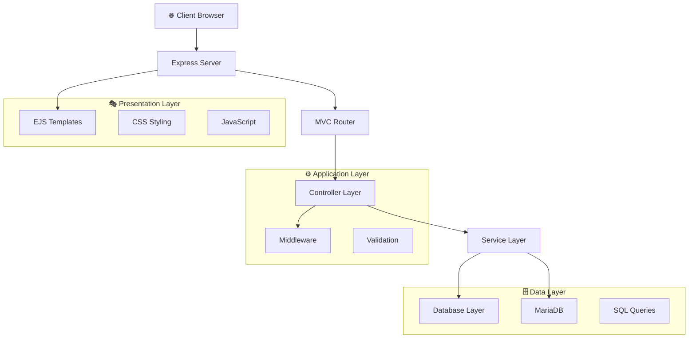
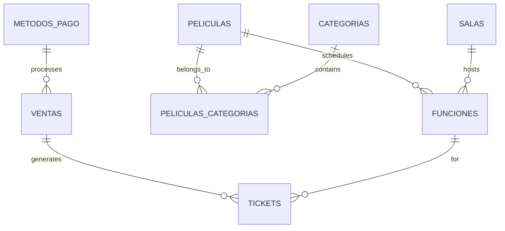

# 🎬 Sistema de Gestión de Cines - Cine Glorimar

[](https://nodejs.org/)
[](https://expressjs.com/)
[](https://mariadb.org/)
[](LICENSE)
[](CONTRIBUTING.md)

> Un sistema completo de gestión de cines construido con Node.js, Express y MariaDB, con interfaces web modernas y APIs RESTful para la gestión completa de operaciones cinematográficas.

## 📋 Tabla de Contenidos

- [🎬 Sistema de Gestión de Cines - Cine Glorimar](#-sistema-de-gestión-de-cines---cine-glorimar)
  - [📋 Tabla de Contenidos](#-tabla-de-contenidos)
  - [✨ Características](#-características)
  - [🏗️ Arquitectura](#️-arquitectura)
  - [🛠️ Tecnologías Utilizadas](#️-tecnologías-utilizadas)
  - [📁 Estructura del Proyecto](#-estructura-del-proyecto)
  - [🚀 Inicio Rápido](#-inicio-rápido)
  - [📖 Documentación de la API](#-documentación-de-la-api)
  - [🎨 Interfaz de Usuario](#-interfaz-de-usuario)
  - [🗄️ Esquema de Base de Datos](#️-esquema-de-base-de-datos)
  - [🔧 Desarrollo](#-desarrollo)
  - [🚀 Despliegue](#-despliegue)
  - [🧪 Pruebas](#-pruebas)
  - [🤝 Contribución](#-contribución)
  - [📝 Registro de Cambios](#-registro-de-cambios)
  - [📄 Licencia](#-licencia)
  - [🙏 Agradecimientos](#-agradecimientos)

## ✨ Características

### 🎯 Funcionalidad Principal
- **🎭 Gestión de Películas**: Operaciones CRUD completas para películas con categorías
- **🎪 Gestión de Funciones**: Programación y gestión de proyecciones de películas
- **🏢 Gestión de Salas**: Manejo de múltiples salas de proyección con control de capacidad
- **💳 Métodos de Pago**: Soporte para diversas opciones de pago
- **📦 Gestión de Productos**: Inventario de productos de confitería
- **🛒 Gestión de Pedidos**: Procesamiento de pedidos de clientes y seguimiento de ventas
- **📊 Análisis de Ventas**: Reportes y análisis completos

### 🎨 Experiencia de Usuario
- **🌐 Interfaz Web Moderna**: Diseño responsivo con plantillas EJS
- **📱 Mobile-First**: Optimizado para todos los tamaños de dispositivo
- **🎭 UI Intuitiva**: Dashboards y formularios amigables para el usuario
- **⚡ Actualizaciones en Tiempo Real**: Carga dinámica de contenido y actualizaciones
- **🔍 Búsqueda Avanzada**: Filtrado y búsqueda en todas las entidades

### 🔧 Características Técnicas
- **🏛️ Arquitectura MVC**: Separación clara de responsabilidades
- **🔄 APIs RESTful**: Endpoints de API completos
- **🛡️ Manejo de Errores**: Gestión robusta de errores y validación
- **📝 Validación de Entrada**: Validación del lado cliente y servidor
- **🔐 Seguridad**: Manejo seguro de datos y prevención de inyección SQL
- **⚡ Rendimiento**: Consultas optimizadas y almacenamiento en caché

## 🏗️ Arquitectura



### Principios Arquitectónicos
- **🎯 Separación de Responsabilidades**: División clara entre rutas, controladores y servicios
- **📦 Diseño Modular**: Componentes y servicios reutilizables
- **🔄 Inyección de Dependencias**: Acoplamiento bajo entre componentes
- **🧪 Capacidad de Prueba**: Soporte para pruebas unitarias e integración
- **📈 Escalabilidad**: Escalado horizontal y vertical

## 🛠️ Tecnologías Utilizadas

### Backend
- **Node.js** - Entorno de ejecución
- **Express.js** - Framework web
- **MariaDB/MySQL** - Base de datos relacional
- **mysql2** - Cliente de base de datos con Promises
- **dotenv** - Gestión de variables de entorno
- **EJS** - Motor de plantillas

### Frontend
- **HTML5** - Marcado semántico
- **CSS3** - Estilos modernos con gradientes y animaciones
- **Bootstrap 5** - Framework CSS responsivo
- **JavaScript (ES6+)** - Funcionalidad interactiva
- **Font Awesome** - Biblioteca de iconos

### Herramientas de Desarrollo
- **Nodemon** - Servidor de desarrollo con recarga automática
- **Git** - Control de versiones
- **VS Code** - IDE con extensiones
- **XAMPP** - Servidor local con MariaDB

## 📁 Estructura del Proyecto

```
proyecto-cine-glorimar/
├── 📂 controllers/           # 🎮 Business logic controllers
│   ├── PeliculasController.js
│   ├── FuncionesController.js
│   ├── SalasController.js
│   ├── MetodosPagoController.js
│   ├── ProductoController.js
│   └── PedidoController.js
├── 📂 routes/               # 🛣️ Express route handlers
│   ├── PeliculasRouter.js
│   ├── FuncionesRouter.js
│   ├── SalasRouter.js
│   ├── MetodosPagoRouter.js
│   ├── productos.js
│   └── pedidos.js
├── 📂 views/                # 🎨 EJS templates
│   ├── index.ejs
│   ├── error.ejs
│   ├── 📂 peliculas/
│   │   ├── listar.ejs
│   │   ├── crear.ejs
│   │   └── editar.ejs
│   ├── 📂 funciones/
│   │   ├── listar.ejs
│   │   ├── crear.ejs
│   │   └── editar.ejs
│   ├── 📂 salas/
│   │   ├── listar.ejs
│   │   ├── crear.ejs
│   │   └── editar.ejs
│   ├── 📂 metodospago/
│   │   ├── listar.ejs
│   │   ├── crear.ejs
│   │   └── editar.ejs
│   ├── 📂 productos/
│   │   ├── listar.ejs
│   │   ├── crear.ejs
│   │   └── editar.ejs
│   └── 📂 pedidos/
│       ├── listar.ejs
│       └── crear.ejs
├── 📂 database/            # 🗄️ Database services
│   └── DBService.js
├── 📂 docs/                # 📚 Documentation
│   ├── DATABASE_SCHEMA.md
│   ├── SCREENSHOTS.md
│   └── TROUBLESHOOTING.md
├── 📄 .env                 # 🔐 Environment configuration
├── 📄 .gitignore           # 🚫 Git ignore rules
├── 📄 app.js               # 🚀 Main application file
├── 📄 package.json         # 📦 Dependencies and scripts
├── 📄 cine.sql            # 🗄️ Database schema
├── 📄 CHANGELOG.md         # 📝 Change log
├── 📄 CONTRIBUTING.md      # 🤝 Contribution guidelines
├── 📄 LICENSE              # 📄 MIT License
└── 📄 README.md           # 📖 Documentation
```

## 🚀 Inicio Rápido

### Prerrequisitos
- **Node.js** 18+ ([Descargar](https://nodejs.org/))
- **XAMPP** con MariaDB/MySQL ([Descargar](https://www.apachefriends.org/))
- **Git** para control de versiones ([Descargar](https://git-scm.com/))
- **Navegador web** moderno (Chrome, Firefox, Edge)

### Instalación

1. **Clonar el repositorio**
   ```bash
   git clone https://github.com/Salvaberticci/proyecto-cine.git
   cd proyecto-cine-glorimar
   ```

2. **Instalar dependencias**
   ```bash
   npm install
   ```

3. **Configurar base de datos**
    ```bash
    # Iniciar XAMPP y el servicio MySQL/MariaDB
    # Crear base de datos 'cine'
    mysql -u root -p -e "CREATE DATABASE IF NOT EXISTS cine;"

    # Importar esquema de base de datos
    mysql -u root -p cine < cine.sql
    ```

4. **Configurar variables de entorno**
    ```bash
    # El archivo .env ya está configurado con valores por defecto
    # Si necesitas cambiar las credenciales de BD, edita el archivo .env
    ```

4. **Iniciar la aplicación**
   ```bash
   # Modo desarrollo
   npm run dev

   # Modo producción
   npm start
   ```

5. **Acceder a la aplicación**
    - **Interfaz Web Principal**: http://localhost:3002
    - **URL Base de API**: http://localhost:3002/api
    - **Documentación API**: Ver sección "📖 Documentación de la API" abajo

### URLs de Acceso Directo
- **Películas**: http://localhost:3002/peliculas
- **Funciones**: http://localhost:3002/funciones
- **Salas**: http://localhost:3002/salas
- **Métodos de Pago**: http://localhost:3002/metodospago
- **Productos**: http://localhost:3002/productos
- **Pedidos**: http://localhost:3002/pedidos

## 📖 Documentación de la API

### 🎭 API de Películas

| Método | Endpoint | Descripción | Respuesta |
|--------|----------|-------------|-----------|
| `GET` | `/api/peliculas` | Listar todas las películas | `200` - Array de películas |
| `GET` | `/api/peliculas/:id` | Obtener película por ID | `200` - Objeto película |
| `POST` | `/api/peliculas` | Crear nueva película | `201` - Película creada |
| `PUT` | `/api/peliculas/:id` | Actualizar película | `200` - Película actualizada |
| `DELETE` | `/api/peliculas/:id` | Eliminar película | `200` - Mensaje de éxito |

**Esquema de Película:**
```json
{
  "id_pelicula": "number",
  "titulo": "string",
  "anio": "number",
  "duracion": "number"
}
```

### 🎪 API de Funciones

| Método | Endpoint | Descripción | Respuesta |
|--------|----------|-------------|-----------|
| `GET` | `/api/funciones` | Listar todas las funciones | `200` - Array de funciones |
| `GET` | `/api/funciones/:id` | Obtener función por ID | `200` - Objeto función |
| `POST` | `/api/funciones` | Crear nueva función | `201` - Función creada |
| `PUT` | `/api/funciones/:id` | Actualizar función | `200` - Función actualizada |
| `DELETE` | `/api/funciones/:id` | Eliminar función | `200` - Mensaje de éxito |

**Esquema de Función:**
```json
{
  "id_funcion": "number",
  "id_pelicula": "number",
  "id_sala": "number",
  "fecha_hora": "datetime"
}
```

### 🏢 API de Salas

| Método | Endpoint | Descripción | Respuesta |
|--------|----------|-------------|-----------|
| `GET` | `/api/salas` | Listar todas las salas | `200` - Array de salas |
| `GET` | `/api/salas/:id` | Obtener sala por ID | `200` - Objeto sala |
| `POST` | `/api/salas` | Crear nueva sala | `201` - Sala creada |
| `PUT` | `/api/salas/:id` | Actualizar sala | `200` - Sala actualizada |
| `DELETE` | `/api/salas/:id` | Eliminar sala | `200` - Mensaje de éxito |

**Esquema de Sala:**
```json
{
  "id_sala": "number",
  "nombre": "string",
  "capacidad": "number"
}
```

### 💳 API de Métodos de Pago

| Método | Endpoint | Descripción | Respuesta |
|--------|----------|-------------|-----------|
| `GET` | `/api/metodospago` | Listar todos los métodos de pago | `200` - Array de métodos |
| `GET` | `/api/metodospago/:id` | Obtener método por ID | `200` - Objeto método |
| `POST` | `/api/metodospago` | Crear nuevo método | `201` - Método creado |
| `PUT` | `/api/metodospago/:id` | Actualizar método | `200` - Método actualizado |
| `DELETE` | `/api/metodospago/:id` | Eliminar método | `200` - Mensaje de éxito |

**Esquema de Método de Pago:**
```json
{
  "id_metodo": "number",
  "nombre": "string"
}
```

### 📦 API de Productos

| Método | Endpoint | Descripción | Respuesta |
|--------|----------|-------------|-----------|
| `GET` | `/api/productos` | Listar todos los productos | `200` - Array de productos |
| `GET` | `/api/productos/:id` | Obtener producto por ID | `200` - Objeto producto |
| `POST` | `/api/productos` | Crear nuevo producto | `201` - Producto creado |
| `PUT` | `/api/productos/:id` | Actualizar producto | `200` - Producto actualizado |
| `DELETE` | `/api/productos/:id` | Eliminar producto | `200` - Mensaje de éxito |

**Esquema de Producto:**
```json
{
  "id": "number",
  "nombre": "string",
  "descripcion": "string",
  "precio": "number",
  "stock": "number",
  "fecha_creacion": "date"
}
```

### 🛒 API de Pedidos

| Método | Endpoint | Descripción | Respuesta |
|--------|----------|-------------|-----------|
| `GET` | `/api/pedidos/ultimos` | Obtener últimos 5 pedidos | `200` - Array de pedidos |
| `GET` | `/api/pedidos` | Listar todos los pedidos | `200` - Array de pedidos |
| `GET` | `/api/pedidos/:id` | Obtener pedido por ID | `200` - Objeto pedido |
| `POST` | `/api/pedidos` | Crear nuevo pedido | `201` - Pedido creado |
| `PUT` | `/api/pedidos/:id` | Actualizar pedido | `200` - Pedido actualizado |
| `DELETE` | `/api/pedidos/:pedidoId/producto/:productoId` | Eliminar relación pedido-producto | `200` - Mensaje de éxito |

### Formato de Respuesta de la API

**Respuesta Exitosa:**
```json
{
  "success": true,
  "data": { ... },
  "message": "Operación completada exitosamente"
}
```

**Respuesta de Error:**
```json
{
  "success": false,
  "message": "Descripción del error",
  "error": "Información detallada del error"
}
```

## 🎨 Interfaz de Usuario

### Dashboard Principal
- **🏠 Página de Inicio**: Navegación centralizada a todas las secciones
- **📊 Tarjetas de Estadísticas**: Métricas y KPIs en tiempo real
- **🎯 Acciones Rápidas**: Acceso directo a operaciones comunes
- **📱 Diseño Responsivo**: Optimizado para escritorio y móvil
- **🎨 UI Moderna**: Fondos con gradientes y animaciones suaves

### Gestión de Películas
- **🎬 Lista de Películas**: Tabla completa con información detallada
- **➕ Agregar Película**: Formulario para nuevas películas
- **✏️ Editar Película**: Formularios precargados con validación
- **🗑️ Eliminar Película**: Confirmación modal para seguridad

### Gestión de Funciones
- **🎪 Lista de Funciones**: Muestra funciones con películas y salas relacionadas
- **📅 Programar Función**: Formulario con dropdowns dinámicos
- **📝 Editar Función**: Modificación de horarios y asignaciones
- **🎯 Gestión de Horarios**: Control completo de proyecciones

### Gestión de Salas
- **🏢 Lista de Salas**: Información de capacidad y estado
- **➕ Crear Sala**: Formulario para nuevas instalaciones
- **✏️ Configurar Sala**: Modificación de capacidad y nombre
- **📊 Indicadores Visuales**: Badges para capacidad de cada sala

### Gestión de Métodos de Pago
- **💳 Lista de Métodos**: Iconos visuales por tipo de pago
- **➕ Agregar Método**: Formulario con sugerencias interactivas
- **✏️ Editar Método**: Modificación de opciones de pago
- **🎨 Clasificación Visual**: Tarjeta, Efectivo, Transferencia

### Gestión de Productos
- **📦 Lista de Productos**: Tabla ordenable con funcionalidad de búsqueda
- **➕ Crear Producto**: Formulario intuitivo con validación
- **✏️ Editar Producto**: Formularios precargados con detección de cambios
- **📊 Alertas de Stock**: Indicadores visuales para inventario bajo

### Gestión de Pedidos
- **🛒 Historial de Pedidos**: Registro completo de transacciones
- **🔍 Filtrado Avanzado**: Búsqueda por fecha, producto, cantidad
- **📊 Análisis**: Tendencias de pedidos y estadísticas
- **🔗 Relaciones**: Gestión de pedidos-productos

## 🗄️ Esquema de Base de Datos

```sql
-- Core Entities
peliculas (id_pelicula, titulo, anio, duracion)
salas (id_sala, nombre, capacidad)
funciones (id_funcion, id_pelicula, id_sala, fecha_hora)
metodos_pago (id_metodo, nombre)

-- Relationships
peliculas_categorias (id_pelicula, id_categoria)
categorias (id_categoria, nombre)

-- Transactions
ventas (id_venta, id_metodo, fecha, total)
tickets (id_ticket, id_venta, id_funcion, asiento, precio)

-- Products & Orders (Extended)
productos (id, nombre, descripcion, precio, stock, fecha_creacion)
pedidos (id, producto_id, cantidad, fecha_pedido)
```

### Database Relationships



## 🔧 Desarrollo

### Configuración de Desarrollo

1. **Clonar e instalar**
   ```bash
   git clone https://github.com/Salvaberticci/proyecto-cine.git
   cd proyecto-cine-glorimar
   npm install
   ```

2. **Configuración de entorno**
   ```bash
   # Crear archivo .env
   cp .env.example .env
   # Editar .env con sus credenciales de base de datos
   ```

3. **Configuración de base de datos**
   ```bash
   mysql -u root -p < cine.sql
   ```

4. **Iniciar servidor de desarrollo**
   ```bash
   npm run dev
   ```

### Calidad de Código

- **ESLint**: Linting de JavaScript
- **Prettier**: Formateo de código
- **Husky**: Hooks de Git para control de calidad
- **Jest**: Framework de pruebas unitarias

### Pruebas

```bash
# Ejecutar todas las pruebas
npm test

# Ejecutar pruebas con cobertura
npm run test:coverage

# Ejecutar pruebas de integración
npm run test:integration
```

## 🚀 Despliegue

### Despliegue en Producción

1. **Configuración de entorno**
   ```bash
   export NODE_ENV=production
   export PORT=3002
   ```

2. **Configuración de base de datos**
   - Actualizar cadenas de conexión para base de datos de producción
   - Asegurar que las copias de seguridad de base de datos estén configuradas

3. **Construir y desplegar**
   ```bash
   npm run build
   npm start
   ```

### Despliegue con Docker

```dockerfile
FROM node:18-alpine
WORKDIR /app
COPY package*.json ./
RUN npm ci --only=production
COPY . .
EXPOSE 3002
CMD ["npm", "start"]
```

### Requisitos del Servidor

- **Node.js**: 18.0 o superior
- **RAM**: Mínimo 512MB, Recomendado 1GB
- **Almacenamiento**: 500MB para aplicación y logs
- **Base de Datos**: MariaDB 10.4+ o MySQL 8.0+

## 🧪 Pruebas

### Pruebas Manuales

1. **Pruebas de API con cURL**
   ```bash
   # Probar listado de películas
   curl http://localhost:3002/api/peliculas

   # Probar creación de producto
   curl -X POST http://localhost:3002/api/productos \
     -H "Content-Type: application/json" \
     -d '{"nombre":"Producto de Prueba","precio":10.99,"stock":50}'
   ```

2. **Pruebas en Navegador**
   - Acceder a http://localhost:3002
   - Probar todas las operaciones CRUD
   - Verificar diseño responsivo

### Pruebas Automatizadas

```bash
# Pruebas unitarias
npm run test:unit

# Pruebas de integración
npm run test:integration

# Pruebas de extremo a extremo
npm run test:e2e
```

## 🤝 Contribución

¡Aceptamos contribuciones! Por favor consulte nuestra [Guía de Contribución](CONTRIBUTING.md) para más detalles.

### Flujo de Desarrollo

1. **Hacer fork** del repositorio
2. **Crear** una rama de característica (`git checkout -b feature/caracteristica-increible`)
3. **Realizar** cambios (`git commit -m 'Agregar característica increíble'`)
4. **Subir** a la rama (`git push origin feature/caracteristica-increible`)
5. **Abrir** una Pull Request

### Estándares de Código

- **JavaScript**: Sintaxis ES6+, async/await preferido
- **CSS**: Metodología BEM, CSS Grid y Flexbox
- **HTML**: Marcado semántico, accesibilidad cumplida
- **SQL**: Sentencias preparadas, consultas indexadas

## 📝 Registro de Cambios

### [v2.0.0] - 2025-10-XX
- ✅ **Base de datos real**: Migración completa de variables a MySQL/MariaDB
- ✅ **Interfaces completas**: Vistas EJS para todas las entidades (Películas, Funciones, Salas, MétodosPago)
- ✅ **Promises/async**: Implementación completa de operaciones asíncronas
- ✅ **Persistencia de datos**: Almacenamiento permanente en base de datos
- ✅ **API completa**: 24+ endpoints RESTful con todas las entidades
- ✅ **UI moderna**: Bootstrap 5 con diseño responsivo y animaciones
- ✅ **Funcionalidad completa**: CRUD operations para gestión cinematográfica

### [v1.0.0] - 2025-01-XX
- ✅ Versión inicial con sistema completo de gestión de cines
- ✅ Implementación de arquitectura MVC
- ✅ Endpoints de API RESTful
- ✅ Interfaz web moderna con plantillas EJS
- ✅ Integración MariaDB con esquema completo
- ✅ Módulos de gestión de productos y pedidos
- ✅ Diseño responsivo y optimización móvil

### [v0.9.0] - 2024-12-XX
- 🔄 Versión beta con funcionalidad principal
- ✅ Operaciones CRUD básicas para todas las entidades
- ✅ Esquema de base de datos y relaciones
- ✅ Enrutamiento Express y middleware
- ✅ Integración de plantillas EJS

## 📄 Licencia

Este proyecto está licenciado bajo la Licencia MIT - consulte el archivo [LICENSE](LICENSE) para más detalles.

## 🙏 Agradecimientos

- **Glorimar**: Arquitectura del proyecto e implementación inicial
- **Equipo de Desarrollo**: Por contribuciones y retroalimentación
- **Comunidad Open Source**: Por las increíbles herramientas y bibliotecas

---

<div align="center">

**Hecho con ❤️ para la excelencia en gestión cinematográfica**

[⬆️ Volver al Inicio](#-sistema-de-gestión-de-cines---cine-glorimar)

</div>