# 🎬 Sistema de Gestión de Cines - Cine Glorimar

[](https://nodejs.org/)
[](https://expressjs.com/)
[](https://mariadb.org/)
[](LICENSE)
[](CONTRIBUTING.md)

> Un sistema completo de gestión de cines construido con Node.js, Express y MariaDB, con interfaces web modernas y APIs RESTful para la gestión completa de operaciones cinematográficas.

## 📋 Table of Contents

- [🎬 Sistema de Gestión de Cines - Cine Glorimar](#-sistema-de-gestión-de-cines---cine-glorimar)
  - [📋 Table of Contents](#-table-of-contents)
  - [✨ Features](#-features)
  - [🏗️ Architecture](#️-architecture)
  - [🛠️ Technology Stack](#️-technology-stack)
  - [📁 Project Structure](#-project-structure)
  - [🚀 Quick Start](#-quick-start)
  - [📖 API Documentation](#-api-documentation)
  - [🎨 User Interface](#-user-interface)
  - [🗄️ Database Schema](#️-database-schema)
  - [🔧 Development](#-development)
  - [🚀 Deployment](#-deployment)
  - [🧪 Testing](#-testing)
  - [🤝 Contributing](#-contributing)
  - [📝 Changelog](#-changelog)
  - [📄 License](#-license)
  - [🙏 Acknowledgments](#-acknowledgments)

## ✨ Features

### 🎯 Funcionalidad Principal
- **🎭 Gestión de Películas**: Operaciones CRUD completas para películas con categorías
- **🎪 Gestión de Funciones**: Programación y gestión de proyecciones de películas
- **🏢 Gestión de Salas**: Manejo de múltiples salas de proyección con control de capacidad
- **💳 Métodos de Pago**: Soporte para diversas opciones de pago
- **📦 Gestión de Productos**: Inventario de productos de confitería
- **🛒 Gestión de Pedidos**: Procesamiento de pedidos de clientes y seguimiento de ventas
- **📊 Análisis de Ventas**: Reportes y análisis completos

### 🎨 Experiencia de Usuario
- **🌐 Interfaz Web Moderna**: Diseño responsivo con plantillas EJS
- **📱 Mobile-First**: Optimizado para todos los tamaños de dispositivo
- **🎭 UI Intuitiva**: Dashboards y formularios amigables para el usuario
- **⚡ Actualizaciones en Tiempo Real**: Carga dinámica de contenido y actualizaciones
- **🔍 Búsqueda Avanzada**: Filtrado y búsqueda en todas las entidades

### 🔧 Características Técnicas
- **🏛️ Arquitectura MVC**: Separación clara de responsabilidades
- **🔄 APIs RESTful**: Endpoints de API completos
- **🛡️ Manejo de Errores**: Gestión robusta de errores y validación
- **📝 Validación de Entrada**: Validación del lado cliente y servidor
- **🔐 Seguridad**: Manejo seguro de datos y prevención de inyección SQL
- **⚡ Rendimiento**: Consultas optimizadas y almacenamiento en caché

## 🏗️ Architecture

```mermaid
graph TB
    A[🌐 Client Browser] --> B[Express Server]
    B --> C[MVC Router]
    C --> D[Controller Layer]
    D --> E[Service Layer]
    E --> F[Database Layer]

    subgraph "🎭 Presentation Layer"
        G[EJS Templates]
        H[CSS Styling]
        I[JavaScript]
    end

    subgraph "⚙️ Application Layer"
        D
        J[Middleware]
        K[Validation]
    end

    subgraph "🗄️ Data Layer"
        F
        L[MariaDB]
        M[SQL Queries]
    end

    B --> G
    D --> J
    E --> L
```



### Principios Arquitectónicos
- **🎯 Separación de Responsabilidades**: División clara entre rutas, controladores y servicios
- **📦 Diseño Modular**: Componentes y servicios reutilizables
- **🔄 Inyección de Dependencias**: Acoplamiento bajo entre componentes
- **🧪 Capacidad de Prueba**: Soporte para pruebas unitarias e integración
- **📈 Escalabilidad**: Escalado horizontal y vertical

## 🛠️ Technology Stack

### Backend
- **Node.js** - Entorno de ejecución
- **Express.js** - Framework web
- **MariaDB** - Base de datos relacional
- **EJS** - Motor de plantillas

### Frontend
- **HTML5** - Marcado semántico
- **CSS3** - Estilos modernos con gradientes y animaciones
- **JavaScript (ES6+)** - Funcionalidad interactiva
- **Font Awesome** - Biblioteca de iconos

### Herramientas de Desarrollo
- **Nodemon** - Servidor de desarrollo con recarga automática
- **Git** - Control de versiones
- **VS Code** - IDE con extensiones

## 📁 Project Structure

```
proyecto-cine-glorimar/
├── 📂 controllers/           # 🎮 Business logic controllers
│   ├── PeliculasController.js
│   ├── FuncionesController.js
│   ├── SalasController.js
│   ├── MetodosPagoController.js
│   ├── ProductoController.js
│   └── PedidoController.js
├── 📂 routes/               # 🛣️ Express route handlers
│   ├── PeliculasRouter.js
│   ├── FuncionesRouter.js
│   ├── SalasRouter.js
│   ├── MetodosPagoRouter.js
│   ├── productos.js
│   └── pedidos.js
├── 📂 views/                # 🎨 EJS templates
│   ├── index.ejs
│   ├── 📂 productos/
│   │   ├── listar.ejs
│   │   ├── crear.ejs
│   │   └── editar.ejs
│   └── 📂 pedidos/
│       └── listar.ejs
├── 📂 database/            # 🗄️ Database services
│   └── DBService.js
├── 📂 public/              # 📁 Static assets (future)
├── 📄 app.js               # 🚀 Main application file
├── 📄 package.json         # 📦 Dependencies and scripts
├── 📄 cine.sql            # 🗄️ Database schema
└── 📄 README.md           # 📖 Documentation
```

## 🚀 Quick Start

### Prerrequisitos
- **Node.js** 18+ ([Descargar](https://nodejs.org/))
- **XAMPP** con MariaDB/MySQL ([Descargar](https://www.apachefriends.org/))
- **Git** para control de versiones ([Descargar](https://git-scm.com/))

### Instalación

1. **Clonar el repositorio**
   ```bash
   git clone https://github.com/Salvaberticci/proyecto-cine.git
   cd proyecto-cine-glorimar
   ```

2. **Instalar dependencias**
   ```bash
   npm install
   ```

3. **Configurar base de datos**
   ```bash
   # Iniciar XAMPP y el servicio MySQL
   # Importar esquema de base de datos
   mysql -u root < cine.sql
   ```

4. **Iniciar la aplicación**
   ```bash
   # Modo desarrollo
   npm run dev

   # Modo producción
   npm start
   ```

5. **Acceder a la aplicación**
   - Interfaz Web: http://localhost:3002
   - URL Base de API: http://localhost:3002/api

## 📖 API Documentation

### 🎭 API de Películas

| Método | Endpoint | Descripción | Respuesta |
|--------|----------|-------------|-----------|
| `GET` | `/api/peliculas` | Listar todas las películas | `200` - Array de películas |
| `GET` | `/api/peliculas/:id` | Obtener película por ID | `200` - Objeto película |
| `POST` | `/api/peliculas` | Crear nueva película | `201` - Película creada |
| `PUT` | `/api/peliculas/:id` | Actualizar película | `200` - Película actualizada |
| `DELETE` | `/api/peliculas/:id` | Eliminar película | `200` - Mensaje de éxito |

**Esquema de Película:**
```json
{
  "id_pelicula": "number",
  "titulo": "string",
  "anio": "number",
  "duracion": "number",
  "categorias": ["string"]
}
```

### 🎪 API de Funciones

| Método | Endpoint | Descripción | Respuesta |
|--------|----------|-------------|-----------|
| `GET` | `/api/funciones` | Listar todas las funciones | `200` - Array de funciones |
| `GET` | `/api/funciones/:id` | Obtener función por ID | `200` - Objeto función |
| `POST` | `/api/funciones` | Crear nueva función | `201` - Función creada |
| `PUT` | `/api/funciones/:id` | Actualizar función | `200` - Función actualizada |
| `DELETE` | `/api/funciones/:id` | Eliminar función | `200` - Mensaje de éxito |

### 📦 API de Productos

| Método | Endpoint | Descripción | Respuesta |
|--------|----------|-------------|-----------|
| `GET` | `/api/productos` | Listar todos los productos | `200` - Array de productos |
| `GET` | `/api/productos/:id` | Obtener producto por ID | `200` - Objeto producto |
| `POST` | `/api/productos` | Crear nuevo producto | `201` - Producto creado |
| `PUT` | `/api/productos/:id` | Actualizar producto | `200` - Producto actualizado |
| `DELETE` | `/api/productos/:id` | Eliminar producto | `200` - Mensaje de éxito |

### 🛒 API de Pedidos

| Método | Endpoint | Descripción | Respuesta |
|--------|----------|-------------|-----------|
| `GET` | `/api/pedidos/ultimos` | Obtener últimos 5 pedidos | `200` - Array de pedidos |
| `GET` | `/api/pedidos` | Listar todos los pedidos | `200` - Array de pedidos |
| `POST` | `/api/pedidos` | Crear nuevo pedido | `201` - Pedido creado |

### Formato de Respuesta de la API

**Respuesta Exitosa:**
```json
{
  "success": true,
  "data": { ... },
  "message": "Operación completada exitosamente"
}
```

**Respuesta de Error:**
```json
{
  "success": false,
  "message": "Descripción del error",
  "error": "Información detallada del error"
}
```

## 🎨 User Interface

### Dashboard
- **📊 Tarjetas de Estadísticas**: Métricas y KPIs en tiempo real
- **🎯 Acciones Rápidas**: Acceso directo a operaciones comunes
- **📱 Diseño Responsivo**: Optimizado para escritorio y móvil
- **🎨 UI Moderna**: Fondos con gradientes y animaciones suaves

### Gestión de Productos
- **📋 Lista de Productos**: Tabla ordenable con funcionalidad de búsqueda
- **➕ Crear Producto**: Formulario intuitivo con validación
- **✏️ Editar Producto**: Formularios precargados con detección de cambios
- **📊 Alertas de Stock**: Indicadores visuales para inventario bajo

### Gestión de Pedidos
- **📈 Historial de Pedidos**: Registro completo de transacciones
- **🔍 Filtrado Avanzado**: Búsqueda por fecha, producto, cantidad
- **📊 Análisis**: Tendencias de pedidos y estadísticas

## 🗄️ Database Schema

```sql
-- Core Entities
peliculas (id_pelicula, titulo, anio, duracion)
salas (id_sala, nombre, capacidad)
funciones (id_funcion, id_pelicula, id_sala, fecha_hora)
metodos_pago (id_metodo, nombre)

-- Relationships
peliculas_categorias (id_pelicula, id_categoria)
categorias (id_categoria, nombre)

-- Transactions
ventas (id_venta, id_metodo, fecha, total)
tickets (id_ticket, id_venta, id_funcion, asiento, precio)

-- Products & Orders (Extended)
productos (id, nombre, descripcion, precio, stock, fecha_creacion)
pedidos (id, producto_id, cantidad, fecha_pedido)
```

### Database Relationships


## 🔧 Development

### Configuración de Desarrollo

1. **Clonar e instalar**
   ```bash
   git clone https://github.com/Salvaberticci/proyecto-cine.git
   cd proyecto-cine-glorimar
   npm install
   ```

2. **Configuración de entorno**
   ```bash
   # Crear archivo .env
   cp .env.example .env
   # Editar .env con sus credenciales de base de datos
   ```

3. **Configuración de base de datos**
   ```bash
   mysql -u root -p < cine.sql
   ```

4. **Iniciar servidor de desarrollo**
   ```bash
   npm run dev
   ```

### Calidad de Código

- **ESLint**: Linting de JavaScript
- **Prettier**: Formateo de código
- **Husky**: Hooks de Git para control de calidad
- **Jest**: Framework de pruebas unitarias

### Pruebas

```bash
# Ejecutar todas las pruebas
npm test

# Ejecutar pruebas con cobertura
npm run test:coverage

# Ejecutar pruebas de integración
npm run test:integration
```

## 🚀 Deployment

### Despliegue en Producción

1. **Configuración de entorno**
   ```bash
   export NODE_ENV=production
   export PORT=3002
   ```

2. **Configuración de base de datos**
   - Actualizar cadenas de conexión para base de datos de producción
   - Asegurar que las copias de seguridad de base de datos estén configuradas

3. **Construir y desplegar**
   ```bash
   npm run build
   npm start
   ```

### Despliegue con Docker

```dockerfile
FROM node:18-alpine
WORKDIR /app
COPY package*.json ./
RUN npm ci --only=production
COPY . .
EXPOSE 3002
CMD ["npm", "start"]
```

### Requisitos del Servidor

- **Node.js**: 18.0 o superior
- **RAM**: Mínimo 512MB, Recomendado 1GB
- **Almacenamiento**: 500MB para aplicación y logs
- **Base de Datos**: MariaDB 10.4+ o MySQL 8.0+

## 🧪 Testing

### Pruebas Manuales

1. **Pruebas de API con cURL**
   ```bash
   # Probar listado de películas
   curl http://localhost:3002/api/peliculas

   # Probar creación de producto
   curl -X POST http://localhost:3002/api/productos \
     -H "Content-Type: application/json" \
     -d '{"nombre":"Producto de Prueba","precio":10.99,"stock":50}'
   ```

2. **Pruebas en Navegador**
   - Acceder a http://localhost:3002
   - Probar todas las operaciones CRUD
   - Verificar diseño responsivo

### Pruebas Automatizadas

```bash
# Pruebas unitarias
npm run test:unit

# Pruebas de integración
npm run test:integration

# Pruebas de extremo a extremo
npm run test:e2e
```

## 🤝 Contribución

¡Aceptamos contribuciones! Por favor consulte nuestra [Guía de Contribución](CONTRIBUTING.md) para más detalles.

### Flujo de Desarrollo

1. **Hacer fork** del repositorio
2. **Crear** una rama de característica (`git checkout -b feature/caracteristica-increible`)
3. **Realizar** cambios (`git commit -m 'Agregar característica increíble'`)
4. **Subir** a la rama (`git push origin feature/caracteristica-increible`)
5. **Abrir** una Pull Request

### Estándares de Código

- **JavaScript**: Sintaxis ES6+, async/await preferido
- **CSS**: Metodología BEM, CSS Grid y Flexbox
- **HTML**: Marcado semántico, accesibilidad cumplida
- **SQL**: Sentencias preparadas, consultas indexadas

## 📝 Registro de Cambios

### [v1.0.0] - 2025-01-XX
- ✅ Versión inicial con sistema completo de gestión de cines
- ✅ Implementación de arquitectura MVC
- ✅ Endpoints de API RESTful
- ✅ Interfaz web moderna con plantillas EJS
- ✅ Integración MariaDB con esquema completo
- ✅ Módulos de gestión de productos y pedidos
- ✅ Diseño responsivo y optimización móvil

### [v0.9.0] - 2024-12-XX
- 🔄 Versión beta con funcionalidad principal
- ✅ Operaciones CRUD básicas para todas las entidades
- ✅ Esquema de base de datos y relaciones
- ✅ Enrutamiento Express y middleware
- ✅ Integración de plantillas EJS

## 📄 License

This project is licensed under the MIT License - see the [LICENSE](LICENSE) file for details.

## 🙏 Acknowledgments

- **Glorimar**: Project architecture and initial implementation
- **Development Team**: For contributions and feedback
- **Open Source Community**: For the amazing tools and libraries

---

<div align="center">

**Made with ❤️ for cinema management excellence**

[⬆️ Back to Top](#-cine-glorimar---cinema-management-system)

</div>