# Screenshots & Mockups

This document contains screenshots and visual representations of the Cine Glorimar cinema management system.

## Table of Contents

- [Dashboard](#dashboard)
- [Product Management](#product-management)
- [Order Management](#order-management)
- [API Documentation](#api-documentation)
- [Mobile Views](#mobile-views)
- [Architecture Diagrams](#architecture-diagrams)

## Dashboard

### Main Dashboard

*Main dashboard showing system statistics and navigation cards*

**Features shown:**
- Real-time statistics (total products, low stock alerts)
- Quick action buttons for common operations
- System information panel
- API endpoint shortcuts

### System Information Panel

*Technical architecture information and system status*

## Product Management

### Product List View

*Complete product inventory with search and filtering*

**Features:**
- Product table with ID, name, description, price, stock
- Color-coded stock levels (high/medium/low)
- Search functionality
- Edit action buttons

### Add New Product Form

*Product creation form with validation*

**Form fields:**
- Product name (required)
- Description (required)
- Price (numeric, required)
- Stock quantity (numeric, required)

### Edit Product Form

*Product editing interface with change detection*

**Features:**
- Pre-populated form fields
- Visual change indicators
- Validation feedback
- Update confirmation

## Order Management

### Order List View

*Order history with product details*

**Display:**
- Order ID and product information
- Quantity ordered
- Order date
- Product mapping

### Create New Order

*Order creation form with product selection*

**Features:**
- Product dropdown selection
- Quantity input with validation
- Real-time form validation

## API Documentation

### API Endpoints Overview

*Interactive API documentation interface*

**Sections:**
- Movies API (`/api/peliculas`)
- Showtimes API (`/api/funciones`)
- Products API (`/api/productos`)
- Orders API (`/api/pedidos`)

### API Response Examples
```json
// Success Response
{
  "success": true,
  "data": { ... },
  "message": "Operation completed successfully"
}

// Error Response
{
  "success": false,
  "message": "Validation error",
  "error": "Name is required"
}
```

## Mobile Views

### Mobile Dashboard

*Responsive mobile dashboard design*

### Mobile Product Form

*Mobile-optimized form interface*

## Architecture Diagrams

### System Architecture

```mermaid
graph TB
    A[🌐 Client Browser] --> B[Express Server]
    B --> C[MVC Router]
    C --> D[Controller Layer]
    D --> E[Service Layer]
    E --> F[Database Layer]

    subgraph "🎭 Presentation Layer"
        G[EJS Templates]
        H[CSS Styling]
        I[JavaScript]
    end

    subgraph "⚙️ Application Layer"
        D
        J[Middleware]
        K[Validation]
    end

    subgraph "🗄️ Data Layer"
        F
        L[MariaDB]
        M[SQL Queries]
    end
```


### Database Schema


### API Flow Diagram


## User Interface Mockups

### Wireframe - Dashboard
```
┌─────────────────────────────────────────────────┐
│ 🎬 Cine Glorimar - Cinema Management System    │
├─────────────────────────────────────────────────┤
│                                                 │
│  ┌─────────────────┐  ┌─────────────────┐       │
│  │ 📦 Products     │  │ 🛒 Orders       │       │
│  │ 150 items       │  │ 45 orders      │       │
│  │                 │  │                 │       │
│  │ [View] [Create] │  │ [View] [Create] │       │
│  └─────────────────┘  └─────────────────┘       │
│                                                 │
│  ┌─────────────────┐  ┌─────────────────┐       │
│  │ 🎭 Movies       │  │ 🎪 Showtimes    │       │
│  │ 25 movies       │  │ 40 showtimes   │       │
│  │                 │  │                 │       │
│  │ [View] [Create] │  │ [View] [Create] │       │
│  └─────────────────┘  └─────────────────┘       │
│                                                 │
│  System Status: ✅ All systems operational      │
└─────────────────────────────────────────────────┘
```

### Wireframe - Product Management
```
┌─────────────────────────────────────────────────┐
│ 📦 Product Management                          │
├─────────────────────────────────────────────────┤
│ ┌─────────────────────────────────────────────┐ │
│ │ Search: [_________________________] 🔍      │ │
│ └─────────────────────────────────────────────┘ │
│                                                 │
│ ┌─────────────────────────────────────────────┐ │
│ │ ID │ Product Name    │ Price │ Stock │ Act │ │
│ ├─────────────────────────────────────────────┤ │
│ │ 1  │ Palomitas Gde   │ $5.50 │ 100   │ ✏️  │ │
│ │ 2  │ Refresco Med    │ $3.00 │ 150   │ ✏️  │ │
│ │ 3  │ Nachos          │ $7.00 │ 80    │ ✏️  │ │
│ └─────────────────────────────────────────────┘ │
│                                                 │
│ [➕ Add New Product]                             │
└─────────────────────────────────────────────────┘
```

## Color Scheme

### Primary Colors
- **Primary Blue**: `#3498db` - Used for headers and primary actions
- **Success Green**: `#2ecc71` - Used for success states and create actions
- **Warning Orange**: `#f39c12` - Used for edit actions and warnings
- **Danger Red**: `#e74c3c` - Used for delete actions and errors

### Background Gradients
- **Main Background**: `linear-gradient(135deg, #667eea 0%, #764ba2 100%)`
- **Card Backgrounds**: `rgba(255, 255, 255, 0.95)` with blur effects
- **Button Gradients**: Individual gradients for each action type

## Responsive Breakpoints

- **Mobile**: < 768px
- **Tablet**: 768px - 1024px
- **Desktop**: > 1024px

## Browser Support

- ✅ Chrome 90+
- ✅ Firefox 88+
- ✅ Safari 14+
- ✅ Edge 90+
- ✅ Mobile browsers (iOS Safari, Chrome Mobile)

## Performance Metrics

### Load Times
- **Initial Page Load**: < 2 seconds
- **API Response Time**: < 500ms
- **Database Query Time**: < 100ms

### Bundle Size
- **Main Bundle**: ~150KB (gzipped)
- **Vendor Bundle**: ~80KB (gzipped)
- **CSS Bundle**: ~25KB (gzipped)

---

*Note: These are representative screenshots and mockups. Actual implementation may vary slightly based on final styling and responsive design adjustments.*

**Last updated:** January 2025